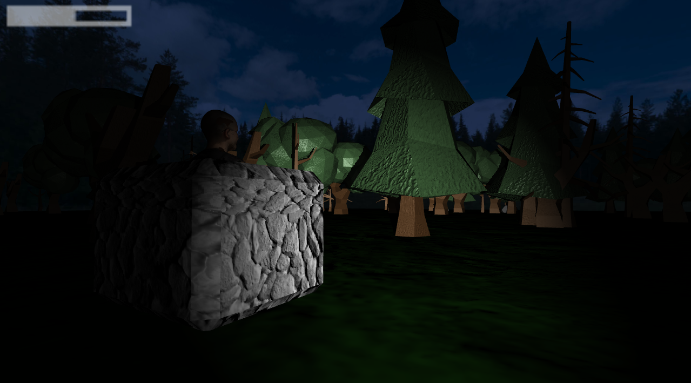
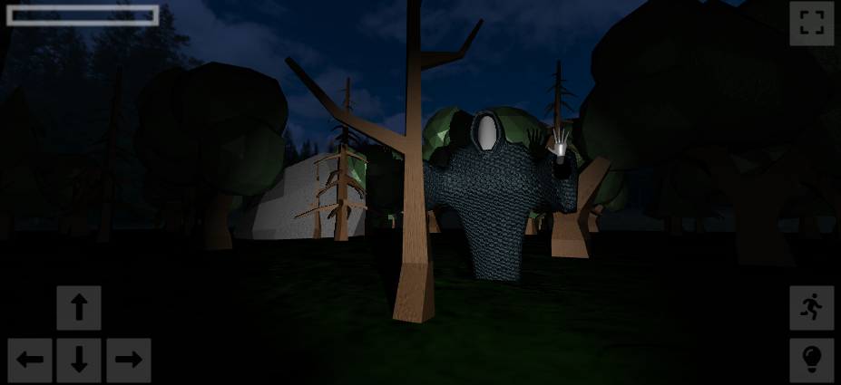

# Forest of Shadows

A horror video game where the player explores a haunted forest, designed to create an immersive and eerie atmosphere. The project was developed using WebGL, with a focus on real-time rendering.

**[Try it here](https://ansioso.github.io/Forest-of-Shadows/)** - Available on both PC and mobile devices.

## Screenshots

  <table>
    <tr>    
        <td align="center" style="padding: 10px;">
            
             
            <em>PC gameplay view</em>
        </dr>
    </tr>
    <tr>        
        <td align="center" width="50%" style="padding: 10px;">
            
             
            <em>Mobile gameplay view</em>
        </dr>
    </tr>
  </table>

## Key Technical Features

- **Specular Mapping**: Implemented to simulate realistic light reflections on surfaces.
- **Normal Mapping**: Used to add fine surface details and enhance the sense of depth without increasing polygon count.
- **Dynamic Shadows**: Integrated to reinforce the horror mood and increase visual immersion.
- **Shading Techniques**: Applied to achieve realistic lighting effects.
